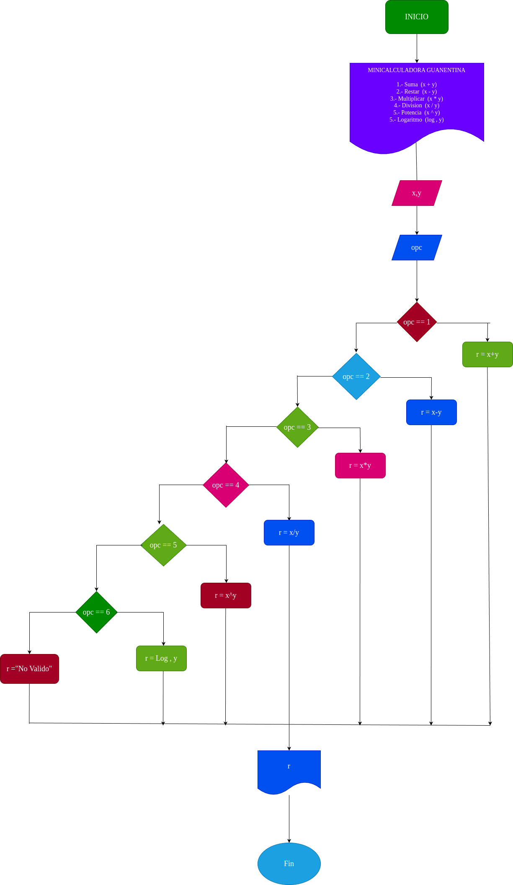

# minicalculadora_guanentina

Programa para realizar distintas operaciones matematicas basicas

# Analisis 
La calculadora llevará a cabo las siguientes operaciones:

Suma = (x+y)

Resta = (x-y)

Multiplicación = (x*y)

División = (x/y)

Potencia = (x^y)

Logaritmo = (Log,y)

## Input

El usuario ingresa los datos a través de la consola. Primero se le pedirá que seleccione la operación matemática que desea realizar (suma, resta, multiplicación, división, potencia o logaritmo).

### Variables de entrada

x : primer numero de la operaciones

y: segundo numero de la operacion

opc: numero correspondiente a las diferentes operaciones posibles

### Processing

opc: numero correspondiente de las diferentes operaciones posibles

### output
x,y

# Diseño

# Construcción
